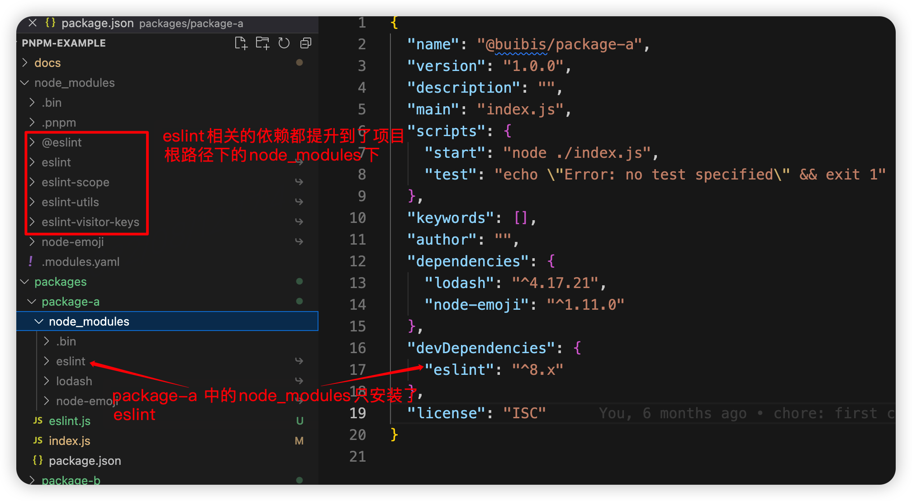

# 关于幻影依赖（[Phantom dependencies](https://rushjs.io/pages/advanced/phantom_deps/)）的问题

pnpm@7.9.0

pnpm 的[`.npmrc`](https://pnpm.io/zh/npmrc)文档

重点 ⚠️⚠️⚠️⚠️⚠️⚠️！

[`hoist`](https://pnpm.io/zh/npmrc#hoist) 默认为 true，将所有依赖项都提升到 `node_modules/.pnpm/node_modules` 中，使得 node_modules 中所有的包都可以访问未列出的依赖项。

<mark style="background: #FFB8EBA6;">意思就是：允许 node_modules 中的包存在幻影依赖，如果包使用了未在 package.json 的 dependencies 中声明的依赖，那么也让其正常工作。</mark>

## 探索 pnpm 不允许幻影依赖（解决幻影依赖的问题）

### 在`package-a`中安装了`lodash`和`eslint`

```json
{
  "dependencies": {
    "lodash": "^4.17.21",
    "node-emoji": "^1.11.0"
  },
  "devDependencies": {
    "eslint": "^8.x"
  }
}
```

### 在`package-b`中并没有安装`lodash`和`eslint`

```json
{
  "dependencies": {},
  "devDependencies": {}
}
```

### `package-b/index.js`中代码如下

```js
const { isArray } = require("lodash");

console.log("isArray", isArray(""), isArray([]));
```

### 执行打印`lodash`

- 输出报错 ❌
- 不允许幻影依赖 ✅

```bash
node packages/package-b/index.js
internal/modules/cjs/loader.js:905
  throw err;
  ^

Error: Cannot find module 'lodash'
Require stack:
- /Users/reahink/develop/github-projects/pnpm-example/packages/package-b/index.js
    at Function.Module._resolveFilename (internal/modules/cjs/loader.js:902:15)
    at Function.Module._load (internal/modules/cjs/loader.js:746:27)
    at Module.require (internal/modules/cjs/loader.js:974:19)
    at require (internal/modules/cjs/helpers.js:101:18)
    at Object.<anonymous> (/Users/reahink/develop/github-projects/pnpm-example/packages/package-b/index.js:1:21)
    at Module._compile (internal/modules/cjs/loader.js:1085:14)
    at Object.Module._extensions..js (internal/modules/cjs/loader.js:1114:10)
    at Module.load (internal/modules/cjs/loader.js:950:32)
    at Function.Module._load (internal/modules/cjs/loader.js:790:12)
    at Function.executeUserEntryPoint [as runMain] (internal/modules/run_main.js:75:12) {
  code: 'MODULE_NOT_FOUND',
  requireStack: [
    '/Users/reahink/develop/github-projects/pnpm-example/packages/package-b/index.js'
  ]
}
```

### 执行打印`eslint`

- 成功输出 ✅
- 对于 eslint 存在幻影依赖 ❌

```
node packages/package-b/eslint.js
eslint {
  Linter: [class Linter],
  ESLint: [class ESLint],
  RuleTester: [class RuleTester] {
    [Symbol(itOnly)]: null,
    [Symbol(it)]: null,
    [Symbol(describe)]: null
  },
  SourceCode: [class SourceCode extends TokenStore]
}
```

这是因为[`public-hoist-pattern`](https://pnpm.io/zh/npmrc#public-hoist-pattern)的默认值为` ['*eslint*', '*prettier*']`。

> 不同于 hoist-pattern 会把依赖提升到一个虚拟存储中的隐藏的模块目录中，public-hoist-pattern 将匹配的依赖提升至根模块目录中。 提升至根模块目录中意味着应用代码可以访问到幻影依赖，即使他们对解析策略做了不当的修改。

<mark style="background: #FF5582A6;">比如，eslint 提升到项目根目录下面配合 vscode 的 eslint 扩展使用的场景。</mark>

**依赖结构**



## monorepo 工程，子包未安装的依赖可以访问到根目录安装的依赖

根目录下安装了`node-emoji`

```json
{
  "dependencies": {
    "node-emoji": "^1.11.0"
  },
  "devDependencies": {}
}
```

`package-b`中没有安装`node-emoji`

然后执行`node packages/package-b/emoji.js`，成功输出 ✅

```bash
node packages/package-b/emoji.js
coffee ☕
```

## 相关链接

关于[pnpm 的 node_modules 配置选项](https://pnpm.io/zh/blog/2020/10/17/node-modules-configuration-options-with-pnpm)，有详细讲解
